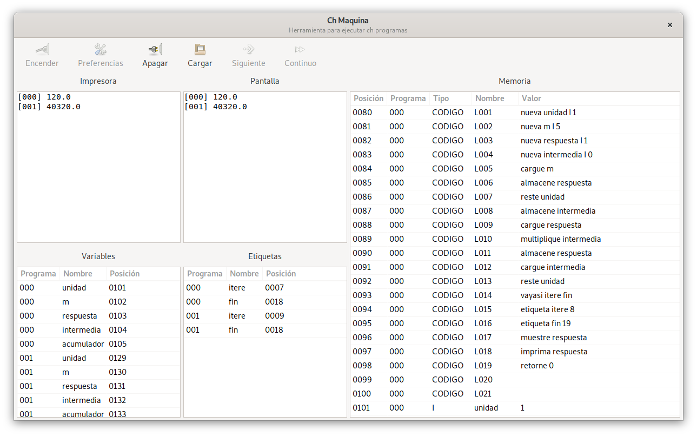

# Implementación del ch-maquina en python



Para las futuras generaciones.

## Instalación en windows

1. Vaya a [http://www.msys2.org/](http://www.msys2.org/) y descarge el `x86_64 installer`
2. Siga las instrucciones de instalación básica en la página
3. Vaya a la carpeta `C:\msys64\` y ejecute la aplicación `mingw32.exe` se debe mostrar una consola esta consola es una "máquina virtual de Linux"
4. Ejecute `pacman -Syu` debe tomar un buen rato
5. Ejecute `pacman -S mingw-w64-i686-gtk3 mingw-w64-i686-python3-gobject`
6. Para probar que esto funcionó ejecute `gtk3-demo` una ventana debe aparecer
7. Ejecute `pacman -S git glade`
8. Ejecute `git clone git@github.com:algomezb/py-chmaquina.git`
9. Entre a la carpeta ejecutando `cd py-chmaquina`
10. Ejecute `./ejecutar-windows`

## Instalación linux

Descargar el código del py-chmaquina, luego en una terminal:

```
cd py-chmaquina
python -m venv venv
source ./venv/bin/activate
pip install -e .
```

Luego para ejecutar la interfaz gráfica:

```
chmaquina
```